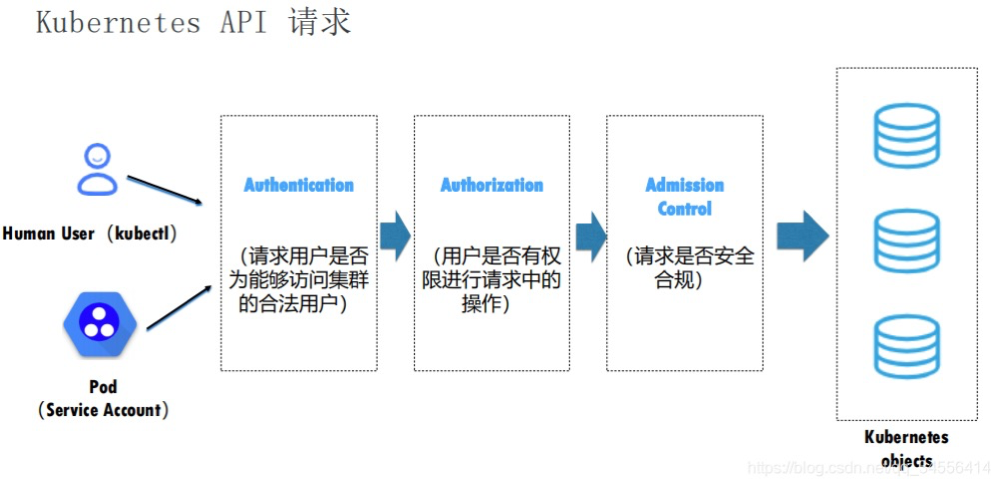

## K8S API SERVER
API-SERVER 的核心功能是提供了对Kubernetes各类资源对象(如Pod、Secret等)进行CRUD等操作的Restful接口，成为集群内各个模块之间数据交互和通信的中心枢纽，是整个集群的数据总线和数据中心。  
 
当我们的 api-server 收到请求后，就会开启访问控制流程。这里面分为三个步骤：  

* **Authentication 认证阶段**：判断请求用户是否为能够访问集群的合法用户。如果用户是个非法用户，那 api-server 会返回一个 401 的状态码，并终止该请求；如果用户合法的话，我们的 api-server 会进入到访问控制的第二阶段 
* **Authorization 鉴权阶段**：在该阶段中 api-server 会判断用户是否有权限进行请求中的操作。如果无权进行操作，api-server 会返回 403 的状态码，并同样终止该请求；如果用户有权进行该操作的话，访问控制会进入到第三个阶段
* **AdmissionControl 准入控制**：在该阶段中 api-server 的 Admission Control 会判断请求是否是一个安全合规的请求。如果最终验证通过的话，访问控制流程才会结束  
此时我们的请求将会转换为一个 Kubernetes objects 相应的变更请求，最终持久化到 ETCD 中。 

对API-SERVER的配置一般在`/etc/kubernetes/manifests/kube-apiserver.yaml`，修改保存后api-server服务会立即重启并生效，为了保证安全性一般不应该开启8080的http端口服务，而使用6443安全端口服务。  

在安全模式下，API-SERVER有三种级别的客户端认证方式
* HTTPS证书认证：基于CA根证书签名的双向数字证书认证方式
* HTTP Token认证：通过一个Token来识别合法用户（较常使用）
* HTTP Base认证：通过用户名+密码的认证方式

### 1.证书认证
